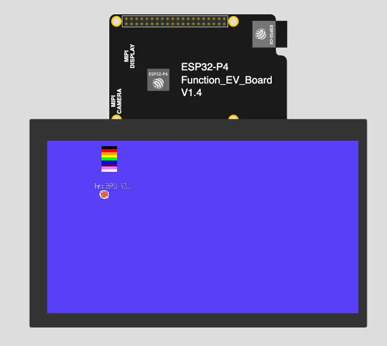

# Example of SDL3 for ESP32


Fork of SDL3 to ESP32 ESP-IDF v5.3+

## On-line Demo Simulation

[](https://wokwi.com/experimental/viewer?diagram=https%3A%2F%2Fraw.githubusercontent.com%2Fgeorgik%2Fesp32-sdl3-example%2Fmain%2Fboards%2Fesp32_p4_function_ev_board%2Fdiagram.json&firmware=https%3A%2F%2Fgithub.com%2Fgeorgik%2Fesp32-sdl3-example%2Freleases%2Fdownload%2Fv0.2.0%2Fesp32-sdl3-example-esp32_p4_function_ev_board.bin)

[Run the ESP32-P4 simulation with Wokwi.com](https://wokwi.com/experimental/viewer?diagram=https%3A%2F%2Fraw.githubusercontent.com%2Fgeorgik%2Fesp32-sdl3-example%2Fmain%2Fboards%2Fesp32_p4_function_ev_board%2Fdiagram.json&firmware=https%3A%2F%2Fgithub.com%2Fgeorgik%2Fesp32-sdl3-example%2Freleases%2Fdownload%2Fv0.2.0%2Fesp32-sdl3-example-esp32_p4_function_ev_board.bin)

Working parts:
- minimalistic SDL3 build
- SDL3 - littlefs integration
- SDL3\_timer
- SDL3\_events
- SDL\_image - BMP
- SDL\_ttf
- Lua 5.5
- touch

## Requirements

`idf_component_manager` 2.x - install manually

## Build

```
git clone git@github.com:georgik/esp32-sdl3-test.git
cd esp32-sdl3-test

idf.py @boards/esp-box-3.cfg set-target esp32-s3
idf.py @boards/esp-box-3.cfg build
```

### Other boards

- ESP32-S3-BOX-3
```shell
idf.py @boards/esp-box-3.cfg reconfigure
```

- ESP32-S3-BOX (prior Dec. 2023)
```shell
idf.py @boards/esp-box.cfg reconfigure
```

- ESP32-P4
```shell
idf.py @boards/esp32_p4_function_ev_board.cfg reconfigure
```

- M5Stack-CoreS3
```shell
idf.py @boards/m5stack_core_s3.cfg reconfigure
```

## Notes

- screen resolution bigger than 320x100 requires enabled PSRAM
- SDL surface for ESP-IDF framebuffer is defined for RGB565
- drawing surface requires `SDL_FRect` as destination, not `SDL_Rect`, in `SDL_Rect` case nothing draws

## Credits

- FreeSans.ttf - https://github.com/opensourcedesign/fonts/blob/master/gnu-freefont_freesans/FreeSans.ttf
